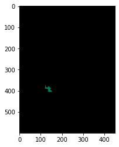

# Activity Log

**7/7/2022**

I spent quite a while trying to get the actual photos into Gitlab using the Web IDE it provides. I eventually gave up on that and just cloned everything to my machine so I could upload all 359 photos a little easier (versus doing it one photo at a time). I renamed and resized all the images (since they didn't need to be 4000 by 6000 pixels, and the large image sizes made upload times take forever). Trying to wrangle the images took the most time. 

Overall, today I:
* Set up the Gitlab where you're reading this
* Renamed, resized, and uploaded all the soil images to this repository
* Tried running a couple images on the sample KerasV3 Colab, copied to my own Lehigh Google Drive. [Link here.](https://colab.research.google.com/drive/16e8fGO9hrRz9-6FhqvkHh6l8k6CMg4QZ?usp=sharing)

**7/12/2022**

I tried swapping out the image that was being evaluated in the aforemention Colab several times to see if any better results were given. I'm not sure if it's just because the photos are lower resolution, but the model is having a terrible time trying to segment anything in the image. I'll see if I can find another pre-trained model that may work better.

Update: the below photo is me running the model with a higher resolution photo. As you can see, it didn't do much better of a job segmenting (the lower res photos just produced an entirely black grid). The image on the right is the high-res image I passed into the model (so you can see what the model *did* segment).

.jpg "High Res Original")

**7/15/22**

Today I met with Joe Desbonnet, one of the other people involved on the project (he's not from the university, but he's the one whose company is working with the soil photos/who supplied the soil photos). I shared my recent progress with him, and he recommended looking into using Open CV software to see if it does a better job with the images than the Deeplab V3 did. He said to look into blob extraction algorithms as well to see if they could extract, say, large areas of brown pixels in a given soil image from everything else around it. I'll take more of a look at it this weekend (I had a busy week with my other class wrapping up here!).

**7/16/22**

Today I began trying to use OpenCV to do some basic image segmentation. I installed all the required packages as recommended on the OpenCV wesbite (numpy, matplotlib, etc.). However, something must've been in the wrong folder somewhere, because I couldn't get any of it to run properly on my machine.

**7/18/22**

Got SUPER sick over the weekend (spent Sunday with a high fever and bedridden; all signs point to it being Covid). Thus, didn't manage to get much done besides meeting with Joe Desbonnet again to check in (and let him know I was sick). I have another meeting scheduled with him and Prof. Schukat (my advisor here) on Wednesday, and I think we wrap up Thursday.

**7/19/22**

Tried once again installing OpenCV--I think it just doesn't like me. Also spent the day fatigued and in bed so hopefully I'll feel better (and be able to get something done) the rest of the week.

**7/20/22**

Somehow had a breakthrough (thanks to SciKit) in the twenty minutes before my meeting. Got some actually presentable masking visuals (hooray!), and am planning to generate more before the meeting on Friday.

**7/22/22**

Had final meeting today with Joe and Dr. Schukat. I compiled a basic PowerPoint of about 7 or 8 soil photo examples with the masking/HSV graphs/etc. It's not super fancy looking, as it isn't my final deliverable, but the link to that is [here](https://docs.google.com/presentation/d/1UoytcKRPnC5iYQ_a_ks9q3NBU2hfIUm2fY_vFDwiXF4/edit?usp=sharing).
